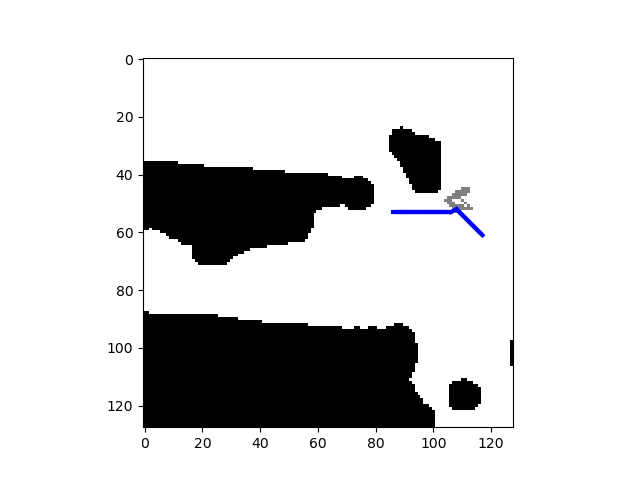

# A deep learning approach to motion planning

## Problem statement
- Implement a neural network to plan a path from a given start position to a given end position in a given map (consists of free space and obstacles)
- Implement a neural network to plan a control inputs to a non-holonomic car from a given start position, orientation to a given end position and orientation in a given map (consists of free space and obstacles)

### Maps
A number of maps were provided, which we divided into [training](./train_maps) and [testing](./test_maps) maps.

#### Map representation
We use the standard cartesian coordinate system (x-axis points right and y-axis points upwards). 
Unit length corresponds to one meter.
     
#### Related files  
Each map consists of two files:
- `floor_trav_0_v2.png`. This is an image representing the occupancy grid. Note that the image is vertically flipped so 
  what you see in plots will be a flipped version of this image.
- `floorplan.yaml` contains metadata of the map
  - `image` filename of the image.
  - `origin` a 2-tuple [x, y] representing the origin w.r.t to the image coordinate system. It is set to [0, 0] for all maps.
    This means that the top left corner of the image corresponds to the origin of the global coordinate system.
  - `resolution` the metric width of one pixel. For example, 0.01 means that a pixel represents a 1cm<sup>2</sup> square.

## Neural network overview
For both problems, we implemented a NN with the following architecture:


Specific implementation details are described in the relevant section below.

## Holonomic point robot (trained with A\* as the supervisor)

### Dataset
- The A\* planner implemented as a part of a previous class assignment (implementation not included in this repository) was used for generating training dataset ([holonomic_data/createData.py](./holomonic_data/createData.py)) for the holonomic point robot.
- First, we generate random croppings of size 128 x 128 pixels ([holonomic_data/images](./holomonic_data/images)) from the given maps (originally 500 x 500, resized to 128 x 128) satisfying the following criteria:
  - the amount of free space should be at least half the image
  - if this is not possible, then the free space should be >33%, >25% etc until it became possible
- Then we run the A\* planner on those maps (corresponding generated paths are in [holonomic_data/paths](./holomonic_data/paths)). For each A\* path generated, we store len(path) data points, with each point along the path used as start_y, start_x and store the result (curr_y, curr_x, goal_y, goal_x, map_file_path, action) as an entry in [holonomic_data/data.csv](./holonomic_data/data.csv). Here, action is a value (1-8) that corresponds to the direction in which the robot moves with respect to its current position as encoded below (x marks the position of the robot):

| 1 | 4 | 6 |
|---|---|---|
| 2 | x | 7 |
| 3 | 5 | 8 |

Each plan generates approx. 75 datapoints and we generate a total of 30k datapoints from generated paths.

### AStarNet
The NN we implemented is a classifier that takes in the current position and the goal position and a map, and outputs probabilities for choosing each of the 8 actions for the current step. See [src/astaret.py](./src/astarnet.py) for more details.

### Training
We implemented a dataloader class to send inputs and labels to the neural network. The input is a tuple containing two elements: (positions, map_image). `positions` is a 1d torch tensor of length 4 containing (curr_y, curr_x, goal_y, goal_x), map_image is a 2d torch tensor of size (128 x 128) containing the map image. The label is a 1d torch tensor of size 1 containing the action to be performed (coded 1-8 for each direction as described above).

The error curve for the training is below:


### Planning

#### Unidirectional planner
Greedy planning: pick action with highest confidence from the NN and execute it from start point till goal point is reached.


To test AStarNet with this planner, run (in [src](./src) directory)
```python
python run_astar.py -s 98 44 -g 33 96 -b False
```
Replace the start and goal positions as required. See `python run_astar.py -h` for more options.

#### Bidirectional planner
Plan one action from start and one from goal position alternately until they meet, then remove unnecessary states with lazy state contraction as described below.


To test AStarNet with this planner, run (in [src](./src) directory)
```python
python run_astar.py -s 98 44 -g 33 96
```
Replace the start and goal positions as required. See `python run_astar.py -h` for more options.

##### Lazy state contraction
We implemented a simple replanning algorithm that removes intermediate states in paths that were unnecessary to take during the bidirectional planning phase. An example is shown below:



### Results
top: path generated by A\* (cost = 84.45), 
middle: path generated by AStarNet with bidirectional planner (cost = 84.87), 
bottom: path generated by AStarNet with unidirectional planner (cost = 86.70)


While testing for the NN's success rate, we check if the action with the highest probability output by the NN leads to an invalid state (eg. running into an obstacle or off the map). If it does, we choose the action with the next highest probability. If all the top three probability actions lead to invalid states, we declare that the NN was unable to find a path.

Below is a summary of a few tests with our implementation of NN and the corresponding planner.

| Planner        | Successes | Testing dataset size | % success |
|----------------|-----------|----------------------|-----------|
| unidirectional |         7 |                   25 |       28% |
| unidirectional |      1427 |                 3068 |    46.51% |
| bidirectional  |        13 |                   25 |       52% |
| bidirectional  |      1728 |                 3068 |    56.32% |

## Non-holonomic car (trained with RRT as the supervisor)

### Dataset
- The RRT planner implemented as a part of a previous class assignment (implementation not included in this repository) was used for generating training dataset ([nonholonomic_data/createData.py](./nonholonomic_data/createData.py)) for the non-holonomic car. We also choose some datapoints where the start and end goal points are the same position with different orientation so that the NN sees a turning in place policy.
- The next steps are similar to the point robot case except that we store a linear velocity and an orientation angle for the car (in [nonholonomic_data/data.csv](./nonholonomic_data/data.csv)) as opposed to just a direction to move in as was the case for the point robot.
We generate a total of approx. 50k datapoints.

### RRTnet
The NN takes in the start position, orientation, goal position, orientation, and the map as the input and outputs the linear velocity and orientation. A significant difference from the AStarNet is that we include a dropout layer because its randomness can help us recover from failed predictions (i.e., the same input can give different outputs). If the network produces an invalid action, we can pass the same input again to obtain a different motions. See [src/rrtnet.py](./src/rrtnet.py) for more details.

### Training
We implemented a dataloader class to send inputs and labels to the neural network. The input is a tuple containing two elements: (positions, map_image). `positions` is a 1d torch tensor of length 6 containing (curr_y, curr_x, curr_theta, goal_y, goal_x, goal_theta), map_image is a 2d torch tensor of size (128 x 128) containing the map image. The label is a 1d torch tensor of size 2 containing (linear_velocity, angle).'

The error curve during training phase is shown below:


### Planning

#### Dropout planner
Greedy planning and dropout: start with a low dropout rate. If the goal is not reached in 150 iterations, increase the dropout rate. If the goal is not reached at even 0.9 dropout rate, declare failure.


To test RRTNet with this planner, run (in [src](./src) directory)
```python
python run_rrt.py -s 90 60 6 -g 120 20 2
```
Replace the start and goal positions, orientations as required. See `python run_rrt.py -h` for more options.

### Results
top: path generated by nonholonomic RRT (cost = 220)
bottom: path generated by RRTNet with dropout planner (cost = 504, dropout probability = 0.7)


Success rate:

| Planner | Successes | Testing dataset size | % success | avg dropout probability |
|---------|-----------|----------------------|-----------|-------------------------|
| dropout |        29 |                   48 |    60.41% |                    0.52 |
| dropout |       708 |                  937 |    75.56% |                    0.41 |

Performance measure of successful plans:

| Testing data | Mean position error | Var. in position error | mean orientation error | var. in orientation error |
|--------------|---------------------|------------------------|------------------------|---------------------------|
|           48 |              6.1992 |                 2.5498 |                 2.3706 |                    1.7587 |
|          937 |              5.8354 |                 2.5622 |                 2.5839 |                    1.4780 |

## Requirements
- pytorch
- opencv
- numpy
- matplotlib
- pandas
- argparse
- pyyaml

## Description of repository contents
- [AStarNetOutputs](./AStarNetOutputs) contains an example each of good and bad (if state validity check is not performed) outputs from AStarNet
- [figs](./figs) contains the figures used in this readme
- [holonomic_data](./holomonic_data) contains all data generated for the holonomic point robot
  - [holonomic_data/images](./holomonic_data/images) contains the randomly cropped map images
  - [holonomic_data/paths](./holomonic_data/paths) contains the paths generated by the A\* planner
  - [holonomic_data/test_images](./holomonic_data/test_images) contains the randomly selected images used for testing AStarNet
  - [holonomic_data/test_paths](./holomonic_data/test_paths) contains the paths generated by the A\* planner used for testing AStarNet
  - [holonomic_data/createData.py](./holomonic_data/createData.py) is the script used to generate data for the holonomic robot
  - [holonomic_data/data.csv](./holomonic_data/data.csv) contains training data from the dataset generated by the A\* planner
  - [holonomic_data/data.csv](./holomonic_data/test_data.csv) is the corresponding testing dataset file
- [nonholonomic_data](./nonholonomic_data) contains all data generated for the non-holonomic car
  - similar structure as for `holonomic_data`
- [src](./src) contains all NN implementations, models and testing scripts
- [test_maps](./test_maps) and [train_maps](./train_maps) contain the original, uncropped maps separated into testing and training categories
- [CSE_571_Project_2_Final_Report.pdf](./CSE_571_Project_2_Final_Report.pdf) is the final project report

## Authors
- [Mino Nakura](https://nakuramino.github.io/)
- [Nishant Elkunchwar](https://students.washington.edu/nishante)
- [Pratik Gyawali](https://www.linkedin.com/in/pratikgyawali)

## Acknowledgements
This project was a course project for CSE 571 AI-based mobile robotics (Spring 2020) at the University of Washington. The authors would like to thank [Prof. Dieter Fox](https://homes.cs.washington.edu/~fox/) and the course TAs, [Xiangyun Meng](https://homes.cs.washington.edu/~xiangyun/) and [Chris Xie](https://chrisdxie.github.io/) for guidance and for providing the simulation environment. The [project report](./CSE_571_Project_2_Final_Report.pdf) and the [video presentation](https://www.youtube.com/watch?v=eke-qAHdnVo) are also linked here.
